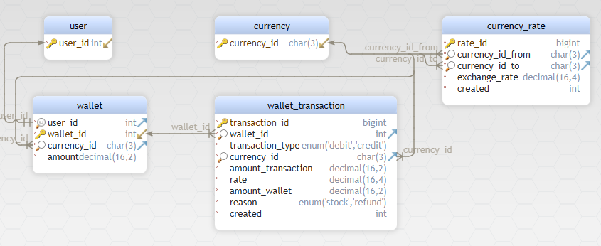

# Database

### Table currency 
| Idx | Field Name | Data Type | Description |
|---|---|---|---|
| *🔑 ⬋ | <a name='symfony.currency_currency_id'>currency&#95;id</a>| char&#40;3&#41;  | ISO4217 ALPHA3 currency code |
| Indexes 
| 🔑 | pk&#95;currency || ON currency&#95;id |  |

### Table currency_rate 
| Idx | Field Name | Data Type | Description |
|---|---|---|---|
| *🔑 | <a name='symfony.currency_rate_rate_id'>rate&#95;id</a>| bigint UNSIGNED AUTO_INCREMENT |  |
| *🔎 ⬈ | <a name='symfony.currency_rate_currency_id_from'>currency&#95;id&#95;from</a>| char&#40;3&#41;  | ISO4217 ALPHA3 currency code |
| *🔎 ⬈ | <a name='symfony.currency_rate_currency_id_to'>currency&#95;id&#95;to</a>| char&#40;3&#41;  | ISO4217 ALPHA3 currency code |
| *| <a name='symfony.currency_rate_exchange_rate'>exchange&#95;rate</a>| decimal&#40;16&#44;4&#41;  | Курс обмена |
| *| <a name='symfony.currency_rate_created'>created</a>| int UNSIGNED  | Дата внесения |
| Indexes 
| 🔑 | pk&#95;currency&#95;rate || ON rate&#95;id |  || 🔎  | fk&#95;currency&#95;rate&#95;currency&#95;currency&#95;id || ON currency&#95;id&#95;from |  || 🔎  | fk&#95;currency&#95;rate&#95;currency&#95;currency&#95;id2 || ON currency&#95;id&#95;to |  || Foreign Keys |  | fk_currency_rate_currency_currency_id | ( currency&#95;id&#95;from ) ref [symfony&#46;currency](#currency) (currency&#95;id) 
|  ||  | fk_currency_rate_currency_currency_id2 | ( currency&#95;id&#95;to ) ref [symfony&#46;currency](#currency) (currency&#95;id) 
|  |

### Table user 
| Idx | Field Name | Data Type |
|---|---|---|
| *🔑 ⬋ | <a name='symfony.user_user_id'>user&#95;id</a>| int UNSIGNED AUTO_INCREMENT |
| Indexes 
| 🔑 | pk&#95;user || ON user&#95;id|

### Table wallet 
| Idx | Field Name | Data Type | Description |
|---|---|---|---|
| *🔍 ⬈ | <a name='symfony.wallet_user_id'>user&#95;id</a>| int UNSIGNED  |  |
| *🔑 ⬋ | <a name='symfony.wallet_wallet_id'>wallet&#95;id</a>| int UNSIGNED AUTO_INCREMENT |  |
| *🔎 ⬈ | <a name='symfony.wallet_currency_id'>currency&#95;id</a>| char&#40;3&#41;  | ISO4217 ALPHA3 currency code |
| *| <a name='symfony.wallet_amount'>amount</a>| decimal&#40;16&#44;2&#41;  |  |
| Indexes 
| 🔑 | pk&#95;wallet || ON wallet&#95;id |  || 🔍  | uk&#95;wallet&#95;user&#95;id || ON user&#95;id |  || 🔎  | fk&#95;wallet&#95;currency&#95;currency&#95;id || ON currency&#95;id |  || Foreign Keys |  | fk_wallet_currency_currency_id | ( currency&#95;id ) ref [symfony&#46;currency](#currency) (currency&#95;id) 
|  ||  | fk_wallet_user_user_id | ( user&#95;id ) ref [symfony&#46;user](#user) (user&#95;id) 
|  |

### Table wallet_transaction 
| Idx | Field Name | Data Type | Description |
|---|---|---|---|
| *🔑 | <a name='symfony.wallet_transaction_transaction_id'>transaction&#95;id</a>| bigint UNSIGNED AUTO_INCREMENT |  |
| *🔎 ⬈ | <a name='symfony.wallet_transaction_wallet_id'>wallet&#95;id</a>| int UNSIGNED  |  |
| *| <a name='symfony.wallet_transaction_transaction_type'>transaction&#95;type</a>| enum&#40;&#39;debit&#39;&#44;&#39;credit&#39;&#41;  | Тип транзакции |
| *🔎 ⬈ | <a name='symfony.wallet_transaction_currency_id'>currency&#95;id</a>| char&#40;3&#41;  | Валюта транзакции |
| *| <a name='symfony.wallet_transaction_amount_transaction'>amount&#95;transaction</a>| decimal&#40;16&#44;2&#41;  | Сумма в валюте транзакции |
| *| <a name='symfony.wallet_transaction_rate'>rate</a>| decimal&#40;16&#44;4&#41;  | Курс обмена в валюту кошелька |
| *| <a name='symfony.wallet_transaction_amount_wallet'>amount&#95;wallet</a>| decimal&#40;16&#44;2&#41;  | Сумма в валюте кошелька |
| *| <a name='symfony.wallet_transaction_reason'>reason</a>| enum&#40;&#39;stock&#39;&#44;&#39;refund&#39;&#41;  | Причина изменения счета |
| *| <a name='symfony.wallet_transaction_created'>created</a>| int UNSIGNED  | Дата внесения |
| Indexes 
| 🔑 | pk&#95;wallet&#95;transaction || ON transaction&#95;id |  || 🔎  | fk&#95;wallet&#95;transaction&#95;currency&#95;currency&#95;id || ON currency&#95;id |  || 🔎  | fk&#95;wallet&#95;transaction&#95;wallet&#95;wallet&#95;id || ON wallet&#95;id |  || Foreign Keys |  | fk_wallet_transaction_currency_currency_id | ( currency&#95;id ) ref [symfony&#46;currency](#currency) (currency&#95;id) 
|  ||  | fk_wallet_transaction_wallet_wallet_id | ( wallet&#95;id ) ref [symfony&#46;wallet](#wallet) (wallet&#95;id) 
|  |

